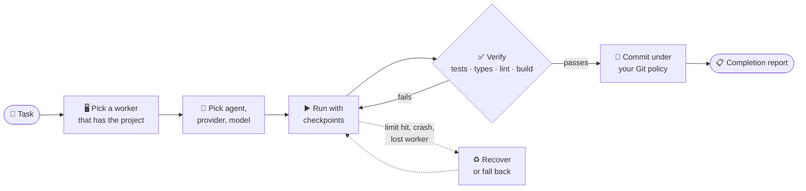

<div align="center">

# 🛰️ Agent Orchestration

### Hand off the task. Get back a commit you can trust.

Run AI coding agents on **your own machines** and only call a task done once **your own checks** prove it.

**Self-hosted** · **Any coding agent** · **Any model provider** · **Your Git rules**

[](https://github.com/ankulalwani/agent-orchestration/actions/workflows/ci.yml)


[⚡ Quick start](#-quick-start) · [🔭 How it works](#-how-it-works) · [📦 What's inside](#-whats-inside) · [📚 Docs](#-documentation) · [🏠 Self-hosting](docs/SELF_HOSTING.md)

</div>

> [!IMPORTANT]
> **No license has been selected yet.** The `LICENSE` file is a placeholder pending legal review. Until a
> license is chosen, no rights to use, modify or distribute this code are granted.

---

## 💡 The idea

AI coding agents are fast, but they say "done" when they are not. Agent Orchestration puts a referee between
the agent and your repository.

```text
   You                         Agent Orchestration                          Your repo
 ───────                ─────────────────────────────────────            ─────────────
 "Fix the flaky   ──▶   find a machine ─▶ run an agent ─▶ verify   ──▶   a verified
  checkout test"        that has the       (with            (tests,         commit +
                        project            checkpoints)      types, lint)   a report
```

- **You** describe the task.
- **A worker** on one of your machines runs the agent.
- **Your tests, type checks, lint and build** decide if the work is real. Failures go back to the agent.
- **Only then** does it commit, under your Git policy.

## 🔭 How it works



The completion report keeps two things apart: **verified facts** (what your checks proved) and **the agent's
own claims** (what it says it did). You always know which is which.

## ✨ Why you might want it

| | |
|---|---|
| 🧠 **Bring any agent** | 23 coding agents are detected on each worker and use their own login: Claude Code, Codex, Gemini CLI, Cursor Agent, GitHub Copilot CLI, OpenCode, Aider, Kiro, Qwen Code, Kimi Code, Grok, Trae Agent and [more](docs/agents/README.md). |
| 🔌 **Bring any model** | OpenRouter, OpenAI, Anthropic, Gemini, Groq, DeepSeek, NVIDIA NIM, Ollama, LM Studio or any OpenAI-compatible endpoint takes over when an agent hits its usage limit. Keys never leave the worker. |
| ✅ **Proof, not promises** | Tests, type checks, lint, build and browser checks run after every attempt. |
| ♻️ **Survives bad days** | Provider limits, context exhaustion, crashes, hangs and lost workers are detected and resumed from checkpoints. |
| 🖥️ **Runs where your code lives** | Workers are native processes on developer machines or servers. The control plane schedules by project, tools and availability. |
| 🌿 **Git your way** | Branch, commit and pull-request policy per project. GitHub and GitLab. |
| 👥 **Built for teams** | Organizations, RBAC, SSO/OAuth, MFA, API tokens, audit log, notifications. |
| 🏠 **Actually self-hosted** | No phone-home, no license server, no caps on tasks, workers, members or projects. |

## ⚡ Quick start

### 🐳 Self-host with Docker Compose

```bash
git clone https://github.com/ankulalwani/agent-orchestration.git && cd agent-orchestration
cp .env.example .env              # then set JWT_SECRET and ENCRYPTION_KEY (see below)
docker compose up -d --build      # control plane + dashboard, MongoDB, Redis
curl http://localhost:4000/healthz
```

Generate each secret with:

```bash
node -e "console.log(require('crypto').randomBytes(32).toString('hex'))"
```

Then:

1. Open **http://localhost:4000**. The first account becomes the administrator.
2. Follow **Getting started** in the dashboard to pair a worker.
3. Run your first task.

The full path, including installing workers, is in [docs/SELF_HOSTING.md](docs/SELF_HOSTING.md).

<details>
<summary><b>🛠️ Run from source (development)</b></summary>

<br>

Prerequisites: Node.js 20.11+, Git, MongoDB (local `mongod` or a container). Redis is optional.

```bash
npm install -g pnpm        # pnpm switches to the version pinned in package.json
pnpm install
pnpm test                  # ~430 tests; uses a local mongod binary if installed

export MONGODB_URI=mongodb://127.0.0.1:27017/agent_orchestration
export JWT_SECRET=$(node -e "console.log(require('crypto').randomBytes(32).toString('hex'))")
export ENCRYPTION_KEY=$(node -e "console.log(require('crypto').randomBytes(32).toString('hex'))")
pnpm dev:api               # http://127.0.0.1:4000
pnpm dev:web               # http://localhost:5173 (proxies /api to :4000)
pnpm dev:worker            # prints the worker UI link with its access token
```

More in [docs/DEVELOPMENT.md](docs/DEVELOPMENT.md).

</details>

## 📦 What's inside

```text
 ┌─────────────── Control plane (apps/api) ───────────────┐
 │  auth · orgs · RBAC · projects · scheduler · audit     │◀── Web dashboard · CLI · VS Code · Mobile
 └───────────────┬──────────────────────┬─────────────────┘
                 │ tasks                │ events
        ┌────────▼────────┐    ┌────────▼────────┐
        │  Worker (Linux) │    │ Worker (macOS)  │   … one per machine, running your agents
        └─────────────────┘    └─────────────────┘
```

| Component | Path | What it does |
|---|---|---|
| 🎛️ **Control plane** | [`apps/api`](apps/api) | Auth, organizations, RBAC, projects, workers, tasks, scheduler, events, audit, notifications. MongoDB plus optional Redis. |
| 🖼️ **Web dashboard** | [`apps/web`](apps/web) | Live operational UI, served by the control plane in production. |
| 🤖 **Worker** | [`apps/worker`](apps/worker) | Native process on each machine: runs agents, Git, verification and recovery. |
| 🪟 **Worker UI** | [`apps/worker-ui`](apps/worker-ui) | Local UI (`127.0.0.1:47821`) for pairing, providers, agents, project paths and diagnostics. |
| 🖥️ **Desktop app** | [`apps/desktop`](apps/desktop) | The worker as an app for Windows, macOS and Linux: window, tray icon, start at login, no Node.js to install. |
| ⌨️ **CLI** | [`apps/cli`](apps/cli) | `agentctl`: tasks, status, logs, worker control, `doctor`. |
| 🧩 **VS Code extension** | [`apps/vscode`](apps/vscode) | Start tasks from a selection, review branches, see the task list in the editor. |
| 📱 **Mobile** | [`apps/mobile`](apps/mobile) | Expo / React Native: monitor, approve, answer agents. |
| 🧱 **Packages** | [`packages/*`](packages) | Core domain (state machine, policies, selection, fallback), contracts, database, agents, providers, git, verification, queue, UI kit. |

**Deploy with:** [Docker Compose](docker-compose.yml) · [Helm](deployment/helm) · [Terraform](deployment/terraform)
· the worker as a [desktop app](docs/workers/README.md#install), or its installers for [Linux](installers/linux), [macOS](installers/macos) and [Windows](installers/windows).

## 🚦 Project status

**Early, but it works end to end:** a task goes from the dashboard to a paired worker, through a real agent
and verification, to a commit.

Every requirement is tracked with evidence in [IMPLEMENTATION_STATUS.md](docs/IMPLEMENTATION_STATUS.md).
Gaps are listed honestly in [KNOWN_LIMITATIONS.md](docs/KNOWN_LIMITATIONS.md). The big ones:

- 🟡 Only **Claude Code** has completed a real coding task. The other adapters follow their documentation.
- 🟡 Docker was verified on Docker Desktop (WSL 2). Helm and Terraform were verified on single-node Kubernetes, not yet on a Linux host or managed cluster.
- 🟡 The mobile app is typechecked and bundled, not yet run on a device.

## 🔌 Extending

Add routes, request hooks and dashboard pages **without forking**, through the `extend` option of `buildApp` /
`startControlPlane` and the web dashboard's extension point. The core never depends on an extension.
See [PUBLIC_PRIVATE_BOUNDARY.md](docs/PUBLIC_PRIVATE_BOUNDARY.md) and [CORE_VERSIONING.md](docs/CORE_VERSIONING.md).

## 📚 Documentation

| 🚀 Start here | 🛡️ Operate | 🧰 Build on it |
|---|---|---|
| [Self-hosting quick path](docs/SELF_HOSTING.md) | [Production self-hosting](docs/self-hosting/README.md) | [Architecture](docs/ARCHITECTURE.md) |
| [Workers](docs/workers/README.md) | [Security](docs/security/README.md) | [API](docs/api/README.md) |
| [Agents](docs/agents/README.md) | [Troubleshooting](docs/troubleshooting/README.md) | [Development](docs/DEVELOPMENT.md) |
| [Providers](docs/providers/README.md) | [Verification](docs/verification/README.md) | [Decisions](docs/DECISIONS.md) |
| [Projects, repositories & GitHub](docs/github/README.md) | [Integrations](docs/integrations/README.md) | [Extension boundary](docs/PUBLIC_PRIVATE_BOUNDARY.md) |
| [Capabilities, skills & MCP](docs/capabilities/README.md) | [Backup & restore](docs/self-hosting/backup-restore.md) | [Release process](docs/RELEASE_PROCESS.md) |

**Planning:** [Implementation plan](docs/IMPLEMENTATION_PLAN.md) · [Status](docs/IMPLEMENTATION_STATUS.md) · [Known limitations](docs/KNOWN_LIMITATIONS.md)

---

<div align="center">

**Your machines. Your agents. Your rules. Verified before it ships.**

</div>
