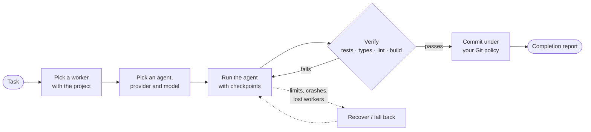

<div align="center">

# Agent Orchestration

**Run AI coding agents across your own machines — and only call a task done once it is verified.**

Self-hostable · any coding agent · any model provider · your Git policy

[](https://github.com/ankulalwani/agent-orchestration/actions/workflows/ci.yml)


[Quick start](#quick-start) · [How it works](#how-it-works) · [Self-hosting](docs/SELF_HOSTING.md) · [Architecture](docs/ARCHITECTURE.md) · [Documentation](#documentation)

</div>

> [!IMPORTANT]
> **No license has been selected yet.** The `LICENSE` file is a placeholder pending legal review; until a
> license is chosen, no rights to use, modify or distribute this code are granted.

---

## How it works

You describe a task. Agent Orchestration finds a machine that can do it, runs a coding agent there, checks the
result with your own tests, and only then commits it.



The completion report separates **verified facts** (what your checks proved) from the **agent's own claims**.

## Features

| | |
|---|---|
| 🧠 **Any agent** | Claude Code, Codex, Gemini CLI, OpenCode, Aider — detected on each worker, using each agent's own login. |
| 🔌 **Any provider** | Add-on models (OpenRouter, OpenAI, Anthropic, Gemini, Groq, DeepSeek, NVIDIA NIM, Ollama, LM Studio, any OpenAI-compatible endpoint) take over when an agent hits its usage limit. Keys stay on the worker. |
| ✅ **Verification first** | Your tests, type checks, lint, build and browser checks run after every attempt; failures go back to the agent. |
| ♻️ **Recovery** | Provider limits, context exhaustion, crashes, hangs and lost workers are detected and recovered from checkpoints. |
| 🖥️ **Your machines** | Workers run natively on developer machines or servers; the control plane schedules by project, tools and availability. |
| 🌿 **Git on your terms** | Branch, commit and pull-request policy per project; GitHub and GitLab. |
| 👥 **Teams** | Organizations, RBAC, SSO/OAuth, MFA, API tokens, audit log, notifications. |
| 🏠 **Truly self-hosted** | No phone-home, no license server, no limits on tasks, workers, members or projects. |

## Quick start

### Self-host with Docker Compose

```bash
git clone https://github.com/ankulalwani/agent-orchestration.git && cd agent-orchestration
cp .env.example .env              # then set JWT_SECRET and ENCRYPTION_KEY (see below)
docker compose up -d --build      # control plane + dashboard, MongoDB, Redis
curl http://localhost:4000/healthz
```

Generate the two secrets with `node -e "console.log(require('crypto').randomBytes(32).toString('hex'))"`.
Open **http://localhost:4000** — the first account becomes the administrator — and follow **Getting started**
to pair a worker and run a first task. The full path, including installing workers, is in
[docs/SELF_HOSTING.md](docs/SELF_HOSTING.md).

<details>
<summary><b>Run from source (development)</b></summary>

Prerequisites: Node.js 20.11+, Git, MongoDB (local `mongod` or a container). Redis is optional.

```bash
npm install -g pnpm        # pnpm switches to the version pinned in package.json
pnpm install
pnpm test                  # ~430 tests; uses a local mongod binary if installed

export MONGODB_URI=mongodb://127.0.0.1:27017/agent_orchestration
export JWT_SECRET=$(node -e "console.log(require('crypto').randomBytes(32).toString('hex'))")
export ENCRYPTION_KEY=$(node -e "console.log(require('crypto').randomBytes(32).toString('hex'))")
pnpm dev:api               # http://127.0.0.1:4000
pnpm dev:web               # http://localhost:5173 (proxies /api to :4000)
pnpm dev:worker            # prints the worker UI link with its access token
```

More in [docs/DEVELOPMENT.md](docs/DEVELOPMENT.md).

</details>

## What's in the box

| Component | Path | Role |
|---|---|---|
| **Control plane** | [`apps/api`](apps/api) | Auth, organizations, RBAC, projects, workers, tasks, scheduler, events, audit, notifications. MongoDB + optional Redis. |
| **Web dashboard** | [`apps/web`](apps/web) | Operational UI with live updates; served by the control plane in production. |
| **Worker** | [`apps/worker`](apps/worker) | Native process on each machine: runs agents, Git, verification and recovery. |
| **Worker UI** | [`apps/worker-ui`](apps/worker-ui) | Local UI (`127.0.0.1:47821`) for pairing, providers, agents, project paths, diagnostics. |
| **CLI** | [`apps/cli`](apps/cli) | `agentctl`: tasks, status, logs, worker control, `doctor`. |
| **VS Code extension** | [`apps/vscode`](apps/vscode) | Tasks from a selection, branch reviews and a task list in the editor. |
| **Mobile** | [`apps/mobile`](apps/mobile) | Expo / React Native: monitoring, approvals, answering agents. |
| **Packages** | [`packages/*`](packages) | Core domain (state machine, policies, selection, fallback), contracts, database, agents, providers, git, verification, queue, UI kit. |

Deployment: [Docker Compose](docker-compose.yml) · [Helm chart](deployment/helm) · [Terraform](deployment/terraform) ·
worker installers for [Linux](installers/linux), [macOS](installers/macos) and [Windows](installers/windows).

## Project status

Early, but working end to end: a task goes from the dashboard to a paired worker, through a real agent and
verification, to a commit. Every requirement is tracked with evidence in
[IMPLEMENTATION_STATUS.md](docs/IMPLEMENTATION_STATUS.md); gaps are listed honestly in
[KNOWN_LIMITATIONS.md](docs/KNOWN_LIMITATIONS.md). Notably:

- Only **Claude Code** has completed a real coding task; the other adapters follow their documentation.
- Docker was verified on Docker Desktop (WSL 2), Helm/Terraform on single-node Kubernetes — not yet on a Linux host or managed cluster.
- The mobile app is typechecked and bundled, not yet run on a device.

## Extending

Distributions and integrations add routes, request hooks and dashboard pages **without forking**, through the
`extend` option of `buildApp` / `startControlPlane` and the web dashboard's extension point. The core never
depends on an extension. See [PUBLIC_PRIVATE_BOUNDARY.md](docs/PUBLIC_PRIVATE_BOUNDARY.md) and
[CORE_VERSIONING.md](docs/CORE_VERSIONING.md).

## Documentation

| Start here | Operate | Build on it |
|---|---|---|
| [Self-hosting quick path](docs/SELF_HOSTING.md) | [Production self-hosting](docs/self-hosting/README.md) | [Architecture](docs/ARCHITECTURE.md) |
| [Workers](docs/workers/README.md) | [Security](docs/security/README.md) | [API](docs/api/README.md) |
| [Agents](docs/agents/README.md) | [Troubleshooting](docs/troubleshooting/README.md) | [Development](docs/DEVELOPMENT.md) |
| [Providers](docs/providers/README.md) | [Verification](docs/verification/README.md) | [Decisions](docs/DECISIONS.md) |
| [Projects, repositories & GitHub](docs/github/README.md) | [Integrations](docs/integrations/README.md) | [Extension boundary](docs/PUBLIC_PRIVATE_BOUNDARY.md) |
| [Capabilities, skills & MCP](docs/capabilities/README.md) | [Backup & restore](docs/self-hosting/backup-restore.md) | [Release process](docs/RELEASE_PROCESS.md) |

Planning: [Implementation plan](docs/IMPLEMENTATION_PLAN.md) · [Status](docs/IMPLEMENTATION_STATUS.md) · [Known limitations](docs/KNOWN_LIMITATIONS.md)
