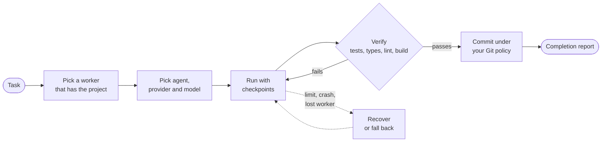
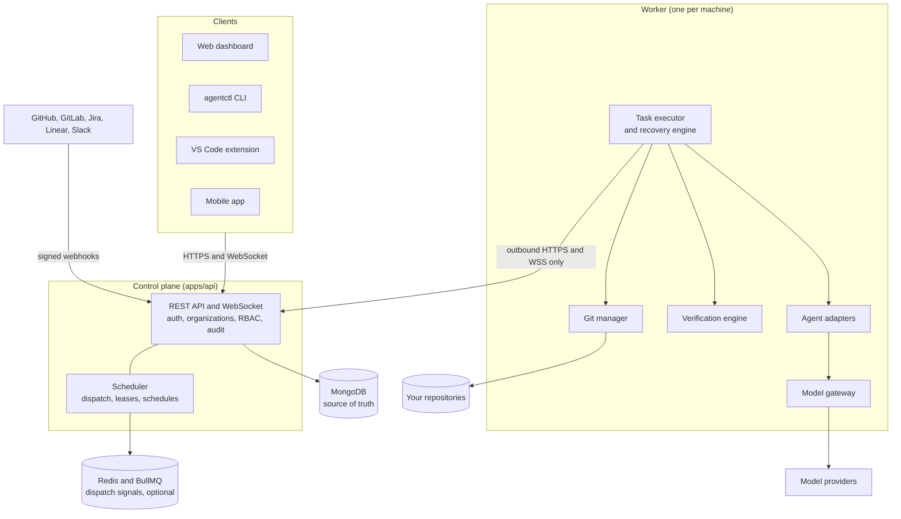

<div align="center">

# Agent Orchestration

### The self-hosted control plane for AI coding agents

**Hand off the task. Get back a commit your own checks have proven.**

Agent Orchestration runs Claude Code, Codex, Gemini CLI, Cursor Agent, Copilot CLI and 18 other coding
agents on **your own machines**, recovers them from usage limits and crashes, and only calls a task done
once **your tests, type checks, lint and build pass**. Then it commits under your Git rules.

[**Get started**](#quick-start) · [**How it works**](#how-it-works) · [**Self-host**](#self-hosting) · [**Managed cloud**](#managed-cloud) · [**Documentation**](#documentation)

[](https://github.com/ankulalwani/agent-orchestration/actions/workflows/ci.yml)
[](https://github.com/ankulalwani/agent-orchestration/releases/latest)
[](https://github.com/ankulalwani/agent-orchestration/pkgs/container/agent-orchestration)


[](https://github.com/ankulalwani/agent-orchestration)

If this is the tool you were about to build yourself, [star the repository](https://github.com/ankulalwani/agent-orchestration) so you can find it again.

</div>

> [!IMPORTANT]
> **The license has not been selected yet.** The complete source is public and the self-hosted product
> has no paid tier, but [`LICENSE`](LICENSE) is a placeholder pending legal review, and it grants no
> rights to use, modify or distribute the code yet. See [License](#license).

<!-- TODO: Add screenshot: dashboard task detail (timeline, verification results, completion report) -->

---

## Contents

[Why this exists](#why-this-exists) · [How it works](#how-it-works) · [What you get](#what-you-get) ·
[Why choose it](#why-choose-it) · [Who it is for](#who-it-is-for) · [Quick start](#quick-start) ·
[Self-hosting](#self-hosting) · [Architecture](#architecture) · [Built to extend](#built-to-extend) ·
[Security](#security) · [Project status](#project-status) · [Managed cloud](#managed-cloud) ·
[Roadmap](#roadmap) · [Contributing](#contributing) · [License](#license)

## Why this exists

AI coding agents are fast, and they say "done" when they are not. Once a team uses more than one of
them, three problems show up:

| Problem | What usually happens | What Agent Orchestration does |
|---|---|---|
| **"Done" is a claim, not a fact** | Someone reads the diff and reruns the tests by hand | Runs your checks after every attempt and sends failures back to the agent |
| **Agents stop halfway** | A usage limit, a full context window or a crash leaves a half-finished branch | Detects each case and continues from a checkpoint, on the same agent or another one |
| **Every agent is its own island** | One terminal per agent per developer, no shared queue, no audit trail | One queue, one dashboard and one policy for 23 agents across all your machines |

The result is a **completion report that keeps two things apart**: verified facts (what your checks
proved) and the agent's own claims (what it says it did).

## How it works



1. **You describe the task** in the dashboard, the CLI, VS Code, a GitHub issue, a Jira ticket or a schedule.
2. **A worker on one of your machines** claims it. Workers are native processes next to your checkout and your agent logins.
3. **The agent runs** inside the mapped project folder, writing checkpoints as it goes.
4. **Your checks decide.** Failed steps go back to the agent, up to a limit you set. After that a person is asked.
5. **Only then** is the work committed, pushed or opened as a pull request, as your Git policy says.

## What you get

### Run any agent, on any model

- **23 agent adapters.** Claude Code, OpenAI Codex, Gemini CLI, Cursor Agent, GitHub Copilot CLI, OpenCode,
  Aider, Kiro, Qwen Code, Kimi Code, Grok, Trae Agent, Amp, Factory Droid, Auggie, Crush, Cline, Kilo Code,
  Pi, Continue, Qoder, CodeBuddy and Mistral Vibe. Workers detect what is installed. See the
  [agent matrix](docs/agents/README.md).
- **Each agent uses its own login by default.** Your Claude subscription, your ChatGPT login, nothing to configure.
- **Add-on models take over at a usage limit.** OpenRouter, OpenAI, Anthropic, Google Gemini, Groq, DeepSeek,
  NVIDIA NIM, Ollama, LM Studio or any OpenAI-compatible endpoint. A built-in model gateway on the
  worker translates between each agent's API and the provider. Agents that support them can also use
  Azure OpenAI, Bedrock and Vertex directly. See [providers](docs/providers/README.md).
- **Several agents on one task.** Let 2 to 4 agents try the same task; the first one that passes verification wins.

### Proof before commit

- **Verification after every attempt:** type check, lint, build and tests, detected from your project
  (`package.json`, Composer, pytest, Go, Rust) or configured as policy.
- **Browser and smoke checks:** Chromium opens your app and fails the step on console errors, page errors
  or failed requests. Route discovery walks links and file-based routes (Next.js, Nuxt, SvelteKit, Remix, Astro).
- **CI as verification:** wait for GitHub checks or GitLab jobs on the pushed commit, and hand failed job logs back to the agent.
- **Reviews and plans:** review tasks comment on a pull request without changing files. Plan tasks split
  a goal into up to 30 dependent tasks that a person approves.

See [verification](docs/verification/README.md).

### Recovery instead of babysitting

| When this happens | The worker does this |
|---|---|
| Usage or rate limit | Switches to a compatible agent or model, waits for the reset, or asks you. A limit never fails a task by itself |
| Context window full | Checkpoints and starts a fresh session from the checkpoint |
| Crash or hang | Restarts with backoff. A hang is declared only after no output, no file changes and near-zero CPU |
| Worker machine dies | The lease expires, another worker continues from the last checkpoint, the old one is fenced off |
| Control plane unreachable | Running tasks continue, events are buffered on disk and synced on reconnect |

### Fits the way your team already works

- **Tasks from where the work is:** GitHub and GitLab issues and comments, Jira, Linear, any system that
  can send a signed webhook, cron schedules and reusable templates. See [integrations](docs/integrations/README.md).
- **Git your way:** commit, commit and push, or pull request, per project. A GitHub App syncs repositories
  into projects, and projects can span several repositories. Review feedback on GitHub becomes a follow-up task on the same branch.
- **Where you already are:** web dashboard, `agentctl` CLI, VS Code extension, Slack (approve, retry and
  answer from chat) and Microsoft Teams notifications.
- **Spend under control:** USD and token budgets per task, project and organization.
- **Insights:** success and first-pass rate, cost, worker utilization, why tasks stopped, and time
  percentiles, with CSV export and a weekly digest. See [operations](docs/operations/README.md).

### Skills, MCP servers and plugins

Every installation owns a **capability registry**: skills (instructions for agents), MCP servers,
plugins (hooks that run on workers in a restricted process) and stacks that install a set in one step.
It has namespaces, versions, trust levels, install policies and approval for risky permissions, and
can mirror the official MCP Registry. See [capabilities](docs/capabilities/README.md).

### Built for teams

Organizations, teams and five roles (owner to viewer), sign-in with Google, GitHub or any OpenID Connect
provider, two-factor authentication with authenticator apps and security keys, SCIM user provisioning,
personal API tokens, an append-only audit log, approvals, and notifications in-app, by email and in chat.

## Why choose it

### Compared with the alternatives

| | **Agent Orchestration** | Agent CLIs by hand | A vendor's hosted agent | Your own scripts on CI |
|---|---|---|---|---|
| Where your code is checked out | Your machines | Your machines | The vendor's cloud | Your CI runners |
| Choice of agent | 23, mixed freely | One per terminal | That vendor's | What you wire up |
| Choice of model | Agent's own login plus add-on providers | Per agent | That vendor's | What you wire up |
| "Done" means | Your checks passed | The agent said so | Depends on the product | What you script |
| Recovery from limits and crashes | Built in, from checkpoints | You, by hand | Depends on the product | You build it |
| Shared queue, roles, audit log | Yes | No | Depends on the product | You build it |
| Self-hostable | Yes | Not applicable | Usually not | Yes |
| Setup effort | One Compose file plus a worker per machine | None | Lowest | Highest, and it never ends |

The columns describe categories, not specific products. Check any product you are evaluating against its own documentation.

### Why not build it yourself

A script that starts an agent is an afternoon. The rest is the product: atomic task claims and leases,
checkpoints, limit detection per agent, fallback across providers, remediation loops, safe Git handling,
signed worker updates, tenant isolation and an audit trail. This repository has all of it, with
[more than 500 automated tests](docs/IMPLEMENTATION_STATUS.md), including chaos tests that kill the
database, the queue and the worker mid-task.

### Self-hosted or managed cloud

The self-hosted product is the complete product. The managed cloud adds convenience, not features.

| | **Self-hosted** | **Managed cloud** (early access) |
|---|---|---|
| Source code | This repository | This repository, plus a hosted layer |
| Features | All of them | The same core |
| Limits on tasks, workers, members, projects | None | By plan |
| Control plane (API, dashboard, database) | You run it | Run for you |
| Workers, code checkouts, agent logins, model keys | Your machines | Your machines |
| Updates and backups of the control plane | You decide when | Handled for you |
| Outbound calls to the vendor | None by default | Not applicable |
| Customization | Full: settings, extension points, your own registry | Standard configuration |
| Cost | Your infrastructure | Subscription |

In both cases **agents run on your machines**. Your repository checkouts and your model provider keys
stay on your workers.

## Who it is for

- **Engineering teams** that already use coding agents and want a shared queue, budgets, approvals and
  an audit trail instead of one terminal per developer.
- **Developers and technical founders** who want agents to keep working overnight and find verified
  commits in the morning, not half-finished branches.
- **Platform and IT teams** that must keep code and credentials on infrastructure they control, with
  single sign-on, provisioning and role-based access.
- **Agencies and consultancies** that work across many client repositories: one organization per client,
  with tenant isolation enforced in the data layer.
- **Self-hosters** who want software that makes no outbound calls unless they turn them on.

## Quick start

**Requirements:** Docker with Docker Compose, Git, and Node.js 20.11 or newer (to generate the secrets
and to run a worker).

### 1. Clone

```bash
git clone https://github.com/ankulalwani/agent-orchestration.git
cd agent-orchestration
```

### 2. Configure

```bash
cp .env.example .env
node -e "console.log('JWT_SECRET=' + require('crypto').randomBytes(32).toString('hex'))"
node -e "console.log('ENCRYPTION_KEY=' + require('crypto').randomBytes(32).toString('hex'))"
```

Put the two printed values into `.env`, replacing the existing `JWT_SECRET` and `ENCRYPTION_KEY` lines.
Back up `ENCRYPTION_KEY`: without it, stored secrets cannot be recovered.

### 3. Run

```bash
docker compose up -d --build      # control plane and dashboard, MongoDB, Redis
curl http://localhost:4000/healthz
```

### 4. Open

Go to **http://localhost:4000** and create the first account. It becomes the administrator of the
installation. Database migrations run on start.

### 5. Add a worker and run a task

On each machine that has your code and your agents, from a checkout of this repository:

```bash
npm install -g pnpm
pnpm install
node scripts/package-worker.mjs           # builds .deploy/worker
installers/linux/install-worker.sh        # or installers/macos/install-worker.sh
```

On Windows: `powershell -ExecutionPolicy Bypass -File installers\windows\install-worker.ps1`

The installer opens the worker's local UI at `http://127.0.0.1:47821`. Enter your control plane URL,
approve the pairing code in the dashboard, then create a project, map it to a local checkout and start
your first task. The dashboard's **Getting started** page walks through the same steps.

On a developer's own computer, the [desktop app](docs/workers/README.md#install) is an alternative to
the installer scripts: it brings its own Node.js.

No agent installed yet? Enable the built-in mock agent on the worker to see the whole flow first.

The complete path is in [docs/SELF_HOSTING.md](docs/SELF_HOSTING.md).

<details>
<summary><b>Run from source (development)</b></summary>

<br>

Requirements: Node.js 20.11+ (22 recommended), Git, MongoDB. Redis is optional. Tests start their own MongoDB.

```bash
npm install -g pnpm        # pnpm switches to the version pinned in package.json
pnpm install
pnpm typecheck
pnpm test

export MONGODB_URI=mongodb://127.0.0.1:27017/agent_orchestration
export JWT_SECRET=$(node -e "console.log(require('crypto').randomBytes(32).toString('hex'))")
export ENCRYPTION_KEY=$(node -e "console.log(require('crypto').randomBytes(32).toString('hex'))")
pnpm dev:api               # http://127.0.0.1:4000
pnpm dev:web               # http://localhost:5173 (proxies /api to :4000)
pnpm dev:worker            # prints the worker UI link with its access token
```

More in [docs/DEVELOPMENT.md](docs/DEVELOPMENT.md).

</details>

## Self-hosting

A self-hosted installation makes **no calls to vendor infrastructure**: no license check, no telemetry,
no mandatory marketplace. It has **no limits** on tasks, workers, members, projects or execution time.

| Option | Use it for | Where |
|---|---|---|
| **Docker Compose** | One server | [`docker-compose.yml`](docker-compose.yml) |
| **Docker Compose with TLS** | One server on a public domain, HTTPS through Caddy | [`docker-compose.production.yml`](docker-compose.production.yml) |
| **Prebuilt image** | Platforms that pull an image, such as [Easypanel](deployment/easypanel) | `ghcr.io/ankulalwani/agent-orchestration` (amd64, arm64) |
| **Helm chart** | Kubernetes, with autoscaling, backups and Prometheus rules as switches | [`deployment/helm`](deployment/helm/agent-orchestration) |
| **Terraform module** | Installing the chart on an existing cluster | [`deployment/terraform`](deployment/terraform/kubernetes) |
| **Node.js directly** | No containers | [Self-hosting guide](docs/self-hosting/README.md) |

**Production with TLS:**

```bash
DOMAIN=orchestration.example.com docker compose -f docker-compose.yml -f docker-compose.production.yml up -d --build
```

This adds Caddy with automatic HTTPS, closes port 4000 and sets resource limits. It needs Docker Compose 2.24 or newer.

**What to know before production:**

| Topic | Details |
|---|---|
| Required settings | `JWT_SECRET` (32+ characters), `ENCRYPTION_KEY` (64 hex characters), `MONGODB_URI` |
| Public address | `PUBLIC_URL`, `WEB_URL`, `CORS_ORIGINS`; set `TRUST_PROXY=true` behind a reverse proxy |
| Data stores | MongoDB 7 is the source of truth. Redis is optional for one instance and required for several |
| Volumes | `mongo-data`, `redis-data`, and `artifacts` for task screenshots and logs (or S3-compatible storage) |
| Ports | `4000` for the API and dashboard. Workers connect outbound, so they need no inbound port |
| Health and metrics | `GET /healthz`, `GET /readyz`, Prometheus metrics at `/metrics` |
| After the first account | Set `ALLOW_REGISTRATION=false` and invite members |
| Backups | `mongodump` plus your `ENCRYPTION_KEY`, stored separately. See [backup and restore](docs/self-hosting/backup-restore.md) |
| Upgrades | Pull, rebuild, restart. Migrations run on start, and workers keep running meanwhile |

Many settings (registration, email, sign-in providers, rate limits, error tracking) can also be changed
in the dashboard without a restart. All settings are listed in [`.env.example`](.env.example) and the
[self-hosting guide](docs/self-hosting/README.md).

## Architecture



| Component | Path | What it does |
|---|---|---|
| **Control plane** | [`apps/api`](apps/api) | Fastify API: authentication, organizations, projects, tasks, scheduler, events, audit, notifications |
| **Web dashboard** | [`apps/web`](apps/web) | Live operational UI, served by the control plane in production |
| **Worker** | [`apps/worker`](apps/worker) | Native process on each machine: runs agents, Git, verification and recovery |
| **Worker UI** | [`apps/worker-ui`](apps/worker-ui) | Local UI on `127.0.0.1:47821` for pairing, providers, agents and project paths |
| **Desktop app** | [`apps/desktop`](apps/desktop) | The worker as a Tauri app for Windows, macOS and Linux: window, tray icon, start at login, bundled Node.js |
| **CLI** | [`apps/cli`](apps/cli) | `agentctl`: tasks, logs, insights, worker control, `doctor` |
| **VS Code extension** | [`apps/vscode`](apps/vscode) | Start a task from a selection, review a branch, see the task list |
| **Mobile app** | [`apps/mobile`](apps/mobile) | Expo and React Native: monitor, approve, answer agents |
| **Packages** | [`packages/*`](packages) | Task state machine and policies, contracts, database, agents, providers, Git, verification, queue, UI kit |

Design choices that matter in practice:

- **MongoDB is the only source of truth.** A task is claimed with one atomic update, so exactly one
  worker wins. Redis only signals, and the queue is rebuilt from MongoDB after an outage.
- **An explicit task state machine.** Undeclared transitions are rejected.
- **Workers connect outbound only**, so developer machines need no open ports.
- **The core is agent-neutral.** Agent specifics live in adapters, and agent, provider and model are chosen independently.

Scaling: run several API instances behind a load balancer with Redis. The Helm chart includes an
autoscaler. No load benchmarks have been published, so size your installation by testing it. More in
[docs/ARCHITECTURE.md](docs/ARCHITECTURE.md).

## Built to extend

| Extension point | What you can do |
|---|---|
| **REST API and OpenAPI** | Everything the dashboard does, under `/api/v1`. The OpenAPI 3.1 document is generated from the request contracts at `/api/v1/openapi.json` |
| **Live updates** | A WebSocket stream of task and worker events |
| **Webhook integrations** | Create tasks from any system with a signed JSON POST, and receive a signed callback with the outcome |
| **API tokens and `agentctl`** | Script it from CI with `AO_SERVER`, `AO_TOKEN` and `AO_ORG` |
| **Agent adapters** | Add an agent by implementing one interface: detect, build the invocation, parse output, classify the exit |
| **Capabilities** | Publish skills, MCP servers and plugins to your own registry |
| **Plugins** | Hooks before the agent starts, during verification and after completion |
| **Control plane and dashboard extensions** | Add routes, request hooks and dashboard pages without forking, through the `extend` option and the web extension point |
| **Policies** | Layered from platform to organization, project, worker and task |

The extension contract is tested in this repository, so a change that would break an extension fails
CI here first. See the [API guide](docs/api/README.md), [extension boundary](docs/PUBLIC_PRIVATE_BOUNDARY.md)
and [versioning](docs/CORE_VERSIONING.md).

## Security

A worker runs code-writing agents on a machine with your source, so the controls below are part of the
core, not an add-on. Each one is implemented and tested. Details are in the [security model](docs/security/README.md).

**Control plane**

- Passwords hashed with scrypt, account lockout, rotating refresh tokens with reuse detection
- Sign-in with Google, GitHub or any OpenID Connect provider (authorization code flow with PKCE)
- Two-factor authentication: authenticator codes, recovery codes, security keys and passkeys (WebAuthn)
- Role-based access control enforced in the service layer on every operation
- Tenant isolation: the organization comes from verified membership, never from the request body
- Security headers and CSP, CORS allow-list, rate limits, CSRF protection
- Organization secrets encrypted with AES-256-GCM, with key rotation, and only ever shown masked
- Secret-like values redacted from logs, events and verification output
- Append-only audit log

**Worker**

- Model provider keys stay on the worker, in the OS credential store
- Agents run only inside project folders you mapped. Path traversal and symlink escapes are rejected
- Agents get an allow-listed environment, not the worker's environment
- Commands run as argument lists, never through a shell
- Force-push, `reset --hard`, `clean` and branch deletion are refused. Your uncommitted changes are never committed
- Worker updates are signed (Ed25519) and verified by the worker, with automatic rollback
- The local UI listens on `127.0.0.1`, requires a token and rejects foreign `Host` headers

**Known gaps, stated plainly**

- The OS-level sandbox for agents (bubblewrap on Linux, `sandbox-exec` on macOS) is **off by default**
  and has not been run on real Linux or macOS systems. Windows has no sandbox. Without it, agents run
  with your user's permissions.
- Plugin isolation uses the Node.js permission model. It is not an OS-level sandbox.
- No third-party security audit or compliance certification exists.

**Reporting a vulnerability:** please do not open a public issue. Report it privately to the
maintainers through GitHub's private vulnerability reporting on this repository.

## Project status

**Early, and working end to end.** A task goes from the dashboard to a paired worker, through a real
agent and verification, to a commit. The latest release is on the
[releases page](https://github.com/ankulalwani/agent-orchestration/releases/latest).

This project tracks every requirement with its evidence in
[IMPLEMENTATION_STATUS.md](docs/IMPLEMENTATION_STATUS.md) and lists its gaps in
[KNOWN_LIMITATIONS.md](docs/KNOWN_LIMITATIONS.md). The ones to know before you rely on it:

- **Only Claude Code has completed a real coding task** through the whole system. The other 22 adapters
  were checked against the real binaries (flags, output formats, failure handling), and some completed a
  task against a test model, but none has run with its vendor's account yet.
- **External services were tested against local stand-ins**, not the live services: model provider APIs,
  GitHub, GitLab, Jira, Linear, Slack, Microsoft Teams, and identity providers.
- **Docker Compose was verified on Docker Desktop** (WSL 2). Helm and Terraform were verified on
  single-node Kubernetes, not on a managed cluster.
- **Worker installers:** Windows ran for real. The macOS and Linux scripts were only syntax-checked.
- **The mobile app** is type-checked and bundled, not yet run on a device.

If you run it somewhere we have not, [tell us what happened](https://github.com/ankulalwani/agent-orchestration/issues).
That is the most useful contribution right now.

## Managed cloud

**Like the project but do not want to run a control plane?**

A managed cloud version is in **early access**. It is this same core, operated for you, with plans and
billing added around it through the public extension points. It contains no private fork of the core.

- **What is hosted:** the control plane, the dashboard and its database.
- **What stays with you:** workers, code checkouts, agent logins and model provider keys. Agents still
  run on your machines.
- **What you skip:** installing, upgrading, backing up and monitoring the control plane.

You pay for convenience, not for access to the technology. Anything a self-hosted installation needs
stays in this repository. That rule is written down in the [extension boundary](docs/PUBLIC_PRIVATE_BOUNDARY.md)
and checked in CI.

Pricing has not been published, and there is no public sign-up link yet.

<!-- TODO: Add the managed cloud sign-up link once the service accepts sign-ups. -->

## Roadmap

**Available now**

- Control plane, dashboard, worker, CLI and VS Code extension
- 23 agent adapters, add-on model providers and the model gateway
- Verification, remediation, checkpoints, recovery and fallback
- Review tasks, plan tasks, follow-ups, several agents on one task
- GitHub App, GitHub and GitLab pull requests, Jira, Linear, Slack and Teams
- Budgets, schedules, templates, insights and the weekly digest
- Capability registry: skills, MCP servers, plugins and stacks
- Single sign-on, two-factor authentication, SCIM, audit log
- Docker Compose, Helm chart, Terraform module, signed worker releases

**In progress**

- **Desktop worker app** for Windows, macOS and Linux ([install notes](docs/workers/README.md#install)).
  Run on Windows and in a Linux container. Installers are not code-signed, and macOS has not been built
  or run yet.
- **Real-world verification** of the remaining agents, providers and integrations with vendor accounts.
- **License selection.**
- **Mobile app** on real devices.

**Not built yet**

- An agent sandbox on Windows
- Approving tasks from Microsoft Teams
- SCIM group provisioning
- Review-feedback follow-ups for GitLab
- A JetBrains plugin (JetBrains IDEs can use `agentctl`)
- Publishing the VS Code extension to the Marketplace

This list names gaps, not delivery dates.

## Documentation

| Start here | Operate | Build on it |
|---|---|---|
| [Self-hosting quick path](docs/SELF_HOSTING.md) | [Production self-hosting](docs/self-hosting/README.md) | [Architecture](docs/ARCHITECTURE.md) |
| [Workers](docs/workers/README.md) | [Security](docs/security/README.md) | [API](docs/api/README.md) |
| [Agents](docs/agents/README.md) | [Backup and restore](docs/self-hosting/backup-restore.md) | [Development](docs/DEVELOPMENT.md) |
| [Providers](docs/providers/README.md) | [Operations: budgets, schedules, insights](docs/operations/README.md) | [Decisions](docs/DECISIONS.md) |
| [Projects, repositories and GitHub](docs/github/README.md) | [Integrations](docs/integrations/README.md) | [Extension boundary](docs/PUBLIC_PRIVATE_BOUNDARY.md) |
| [Capabilities, skills and MCP](docs/capabilities/README.md) | [Troubleshooting](docs/troubleshooting/README.md) | [Release process](docs/RELEASE_PROCESS.md) |
| [Verification](docs/verification/README.md) | [Known limitations](docs/KNOWN_LIMITATIONS.md) | [Implementation status](docs/IMPLEMENTATION_STATUS.md) |

## Contributing

Contributions are welcome, and the most valuable ones right now are small:

- **Run it and report back.** A Linux server, a Mac, a managed Kubernetes cluster, or an agent with your own account.
- **Report a bug** or **ask for a feature** in [issues](https://github.com/ankulalwani/agent-orchestration/issues).
- **Add or fix an agent adapter.** It is one interface: see [adding an adapter](docs/agents/README.md#adding-an-adapter).
- **Improve the documentation.** If a step did not work as written, that is a bug.

```bash
git clone https://github.com/<your-username>/agent-orchestration.git   # your fork
cd agent-orchestration
git checkout -b fix/short-description
pnpm install

# make your change, with a test for new behaviour

pnpm typecheck && pnpm test && node scripts/check-boundary.mjs
git commit -am "Describe the change"
git push origin fix/short-description
```

Then open a pull request against `main`. The full setup, including optional test tools, is in
[docs/DEVELOPMENT.md](docs/DEVELOPMENT.md).

Contribution terms will be set together with the license. Until then, please open an issue before
starting a large change.

## License

**No license has been selected yet.** [`LICENSE`](LICENSE) is a placeholder, and until it is replaced
no rights to use, modify or distribute this code are granted. The choice is waiting for legal review.

What will not change:

- The complete, self-hostable product stays in this public repository.
- Self-hosted installations have no usage limits, no license server and no mandatory outbound calls.
- The managed cloud is a paid convenience around this core. It does not hold core features back.

Watch the repository or its [releases](https://github.com/ankulalwani/agent-orchestration/releases) to
be notified when the license lands.

---

<div align="center">

**Your machines. Your agents. Your rules. Verified before it ships.**

If Agent Orchestration saves you from reviewing one more "done" that was not done,
[give it a star](https://github.com/ankulalwani/agent-orchestration). It helps other teams find it.

</div>
